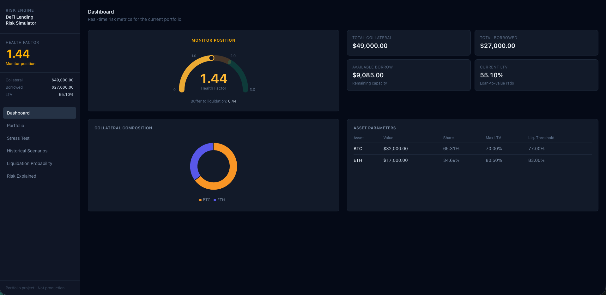
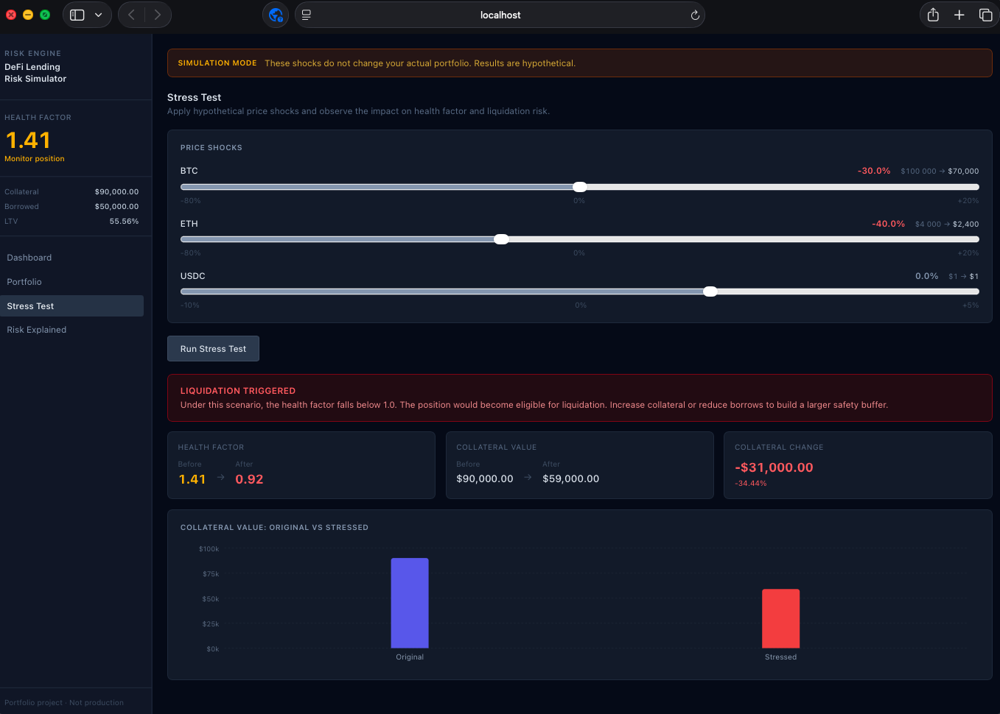

# DeFi Lending Risk Simulator

A banking-inspired risk dashboard for analysing overcollateralised crypto lending positions.

**Live demo:** https://defi-lending-risk-simulator.vercel.app

*Note: the backend runs on Render's free tier and may take ~30–50s to wake on the first request after a period of inactivity.*




---

## Why I built this

Overcollateralised crypto lending and traditional secured lending solve the same problem with the same tools — loan-to-value limits, collateral buffers, liquidation thresholds, and stress testing — just on different infrastructure. Coming from a background in banking and crypto, I built this simulator to make that connection explicit: it translates traditional credit-risk thinking into an interactive tool for analysing DeFi lending positions.

---

## Features

- **Real-time health factor** — calculated on every portfolio change, colour-coded across five risk levels (Safe → Healthy → Monitor → At risk → Liquidatable)
- **Portfolio management** — add and remove collateral and borrow positions, edit market prices, changes reflected immediately
- **Stress testing** — apply per-asset price shocks and see the impact on health factor, collateral value, and liquidation status
- **Risk Explained** — plain-English reference covering LTV, health factor, liquidation thresholds, and why stress testing matters

---

## Tech stack

**Backend**
- Python + FastAPI + Pydantic v2
- Fully stateless — no database, no authentication
- Pure functions throughout: given the same inputs, always the same outputs
- 31 passing tests (pytest)

**Frontend**
- React + TypeScript + Vite
- Tailwind CSS (v4)
- Recharts for the health factor gauge, pie chart, and bar chart
- Axios for API calls; portfolio state persists to localStorage

---

## Getting started

**Requirements:** Python 3.10+, Node.js 20.19+

### Backend

```bash
make install   # creates .venv and installs dependencies
make run       # starts FastAPI on http://localhost:8000
make test      # runs all 31 tests
```

### Frontend

```bash
cd frontend
npm install
npm run dev    # starts Vite dev server on http://localhost:5173
```

Open [http://localhost:5173](http://localhost:5173) with the backend running on `:8000`.

---

## Architecture

The backend is a stateless pure-function risk engine — every endpoint receives the full portfolio and price set in the request body and returns calculated risk metrics. There is no database and no session state. All portfolio state lives in the React frontend and is persisted to `localStorage`, so the risk engine is simply math in / math out. This separation keeps the engine independently testable (all 31 tests run without a running server) and makes it trivial to swap in a different frontend or call the API directly.

---

## Risk model

| Asset | Max LTV | Liquidation Threshold |
|-------|---------|----------------------|
| BTC   | 70%     | 75%                  |
| ETH   | 80%     | 82.5%                |
| USDC  | 85%     | 87.5%                |

**LTV (Loan-to-Value):** the ratio of outstanding debt to total collateral value. The max LTV cap governs how much can be borrowed at origination.

**Health Factor:** the primary solvency indicator — `Σ(collateral_i × price_i × liquidation_threshold_i) / total_borrowed`. A value below 1.0 means the position is eligible for liquidation. The further above 1.0, the larger the buffer against falling prices.

**Liquidation Threshold:** set above the max LTV, it is the point at which an existing position triggers forced liquidation — analogous to a maintenance margin requirement in traditional finance.

Parameters are representative of typical overcollateralised lending protocols. See the in-app **Risk Explained** view for a full plain-English walkthrough.
